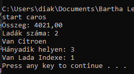

# Felahsználói dokumentáció

## Az alkalmazás célja

Az allkalmazás a járművek adatait olvassa be megadott CSV formátumú fájlból.

## Telepítés

A program futtatásához Java futtatókörnyezet szükséges.

A telepítéshez töltse le a caros.zip fájlt, majd csomagolja ki a tetszőleges helyre. 

## Indítás

A caros könyvtárban talál egy start.bat nevű  fájlt. A fájlkezelőben dupla kattintással futtatható a program.

## Program használata

A program bevitel nélkül fut.

